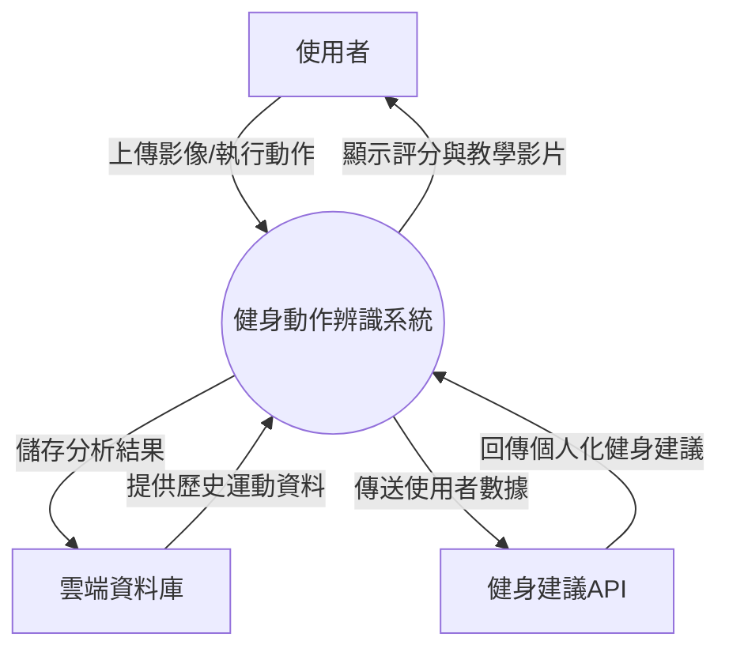
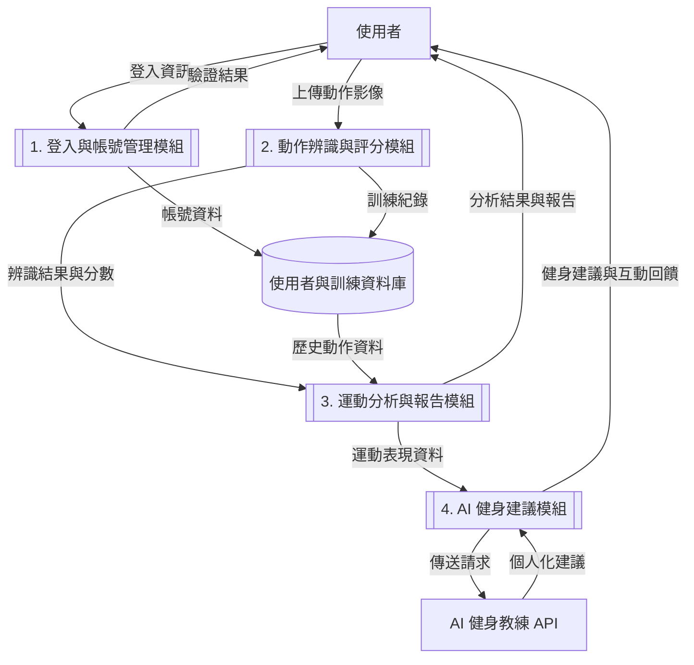

# 小組作業 4

## 一、系統環境圖 (DFD)

> 此系統環境圖描述「基於影像辨識的健身動作系統」的整體外部互動情境。   
系統主要與三個外部實體互動：使用者、雲端資料庫、健身建議API。   

## 二、DFD 圖0

> 此圖將「健身動作辨識系統」拆解為四個主要程序： 
1、登入與帳號管理模組 
2、動作辨識模組 
3、分析與報告模組 
4、健身建議模組 
四者共同處理使用者登入上傳的影像，進行辨識、分析與回饋。 

> ###  圖號說明  
| 圖號 | 程序名稱 | 說明 |
|:------:|:---------:|:----:|
| 1 | 登入與帳號管理模組 | 管理登入登出 |
| 2 |動作辨識與評分模組 | 使用影像辨識模型判斷使用者的健身動作是否正確 |
| 3 | 運動分析與報告模組 | 蒐集多次運動數據，生成圖表與改善建議報告 |
| 4 |  AI 健身建議模組 | 串接 ChatGPT 或 Gemini API，提供個人化健身建議 |
