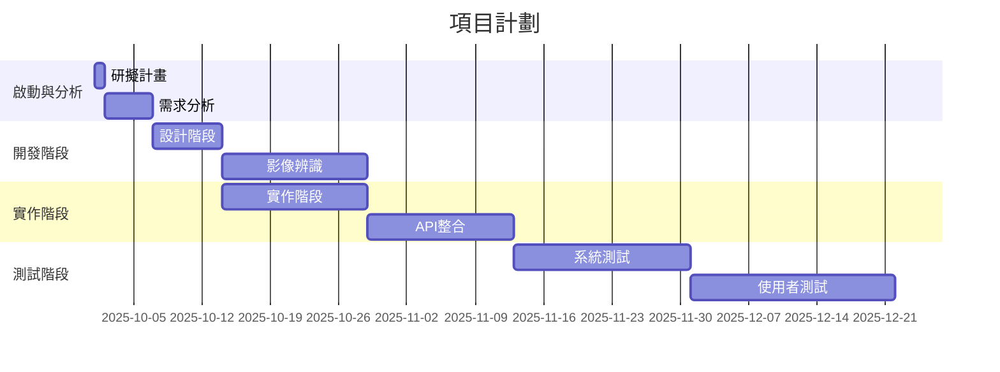
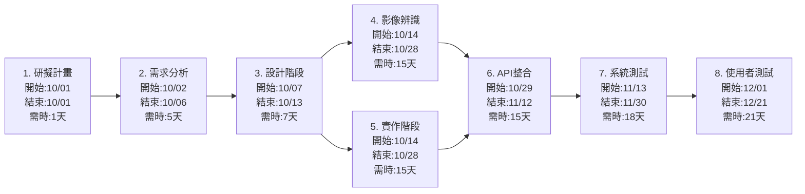

# 第15組
 
## 1.組員任務

| 組員   | 角色 | 任務                                                                 | 預估時間 |
|--------|------|--------------------------------------------------------------------------|----------|
| 陳宥蓁 | 組長 | 動作辨識、API 串接 | 4-6 週   | 
| 許筑翕 | 組員 | 分析與報告 | 3-5 週   | 
| 辜雅雯 | 組員 | GitHub 管理、分析與報告 | 4-6 週   |

## 2.甘特圖

專案時程（2025/10/01 至 2025/12/21，約 12 週）。

## 3.PERT/CPM圖

關鍵路徑：1->2->3->4->6->7->8
