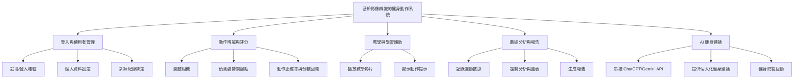
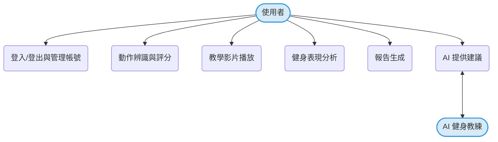

##  小組作業 3：功能性需求與非功能性需求

### 一、功能性需求（Functional Requirements）

| 編號 | 功能性需求 | 說明 |
|------|-------------|------|
| FR1 | 登入與使用者管理 | 使用者可以登入系統，系統能管理個人資料與訓練紀錄。 |
| FR2 | 動作辨識與評分 | 系統能透過手機相機辨識使用者的健身動作（如深蹲、平板撐），計算動作正確率與分數。 |
| FR3 | 教學影片播放 | 提供各動作的示範影片與教學說明，協助使用者學習正確姿勢。 |
| FR4 | 運動數據分析 | 系統能記錄使用者每次運動的表現，並產生趨勢分析圖表。 |
| FR5 | 動作改善追蹤 | 根據歷史資料分析使用者動作改善狀況，提示需加強部位。 |
| FR6 | 報告生成 | 產出週報或月報，顯示分數變化、次數統計與平均表現。 |
| FR7 | AI 提供建議 | 透過串接 ChatGPT 或 Gemini API，提供個人化的健身建議與問答互動。 |

---

### 二、非功能性需求（Non-Functional Requirements）

| 編號 | 非功能性需求 | 說明 |
|------|----------------|------|
| NFR1 | 系統效能 | 動作辨識延遲不超過 3 秒，確保即時回饋。 |
| NFR2 | 使用者介面易用性 | 操作介面簡潔、圖示清晰。 |
| NFR3 | 相容性 | 系統需支援 Android 與 iOS 裝置相機。 |
| NFR4 | 資料安全性 | 使用者影像資料僅用於辨識，不上傳雲端，保障隱私。 |
| NFR5 | 可維護性 | 系統架構模組化，方便後續擴充新動作或新增 API。 |
| NFR6 | 穩定性 | 系統於長時間運行（>1小時）下應保持穩定、不當機。 |

---

### 三、功能分解圖（Functional Decomposition Diagram, FDD）

---

### 四、使用案例圖（Use Case Diagram）

---

### 五、使用案例說明（Use Case Descriptions）

#### 使用案例 1：動作辨識與評分
| 項目 | 說明 |
|------|------|
| **主要參與者** | 使用者 |
| **前置條件** | 使用者允許系統使用相機 |
| **主要流程** | 1. 使用者選擇運動項目（如深蹲） 2. 系統開啟相機並開始辨識動作 3. 系統分析姿勢正確率並顯示分數 4. 使用者查看即時回饋 |
| **例外狀況** | 相機權限未開啟或偵測失敗時，顯示錯誤提示。 |

#### 使用案例 2：運動表現分析與報告生成
| 項目 | 說明 |
|------|------|
| **主要參與者** | 使用者 |
| **前置條件** | 使用者已完成多次訓練記錄 |
| **主要流程** | 1. 使用者開啟「分析報告」功能 2. 系統讀取歷史紀錄並生成圖表 3. 系統顯示趨勢變化與平均分數 4. 使用者可選擇輸出報告（PDF/圖片） |
| **例外狀況** | 若資料不足，顯示提示訊息。 |

#### 使用案例 3：AI 提供建議
| 項目 | 說明 |
|------|------|
| **主要參與者** | 使用者、AI |
| **前置條件** | 系統已串接 ChatGPT 或 Gemini API |
| **主要流程** | 1. 使用者輸入健身相關問題 2. 系統傳送問題至 API 3. AI 回傳個人化建議 4. 系統顯示文字或語音回覆 |
| **例外狀況** | 網路連線中斷或 API 錯誤時，顯示「目前無法提供建議」。 |
