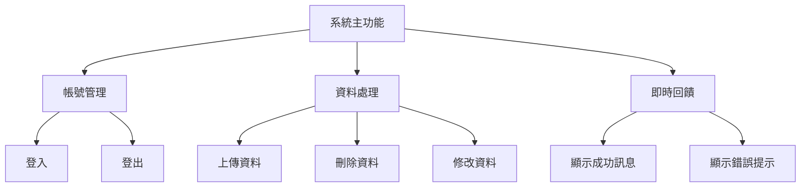
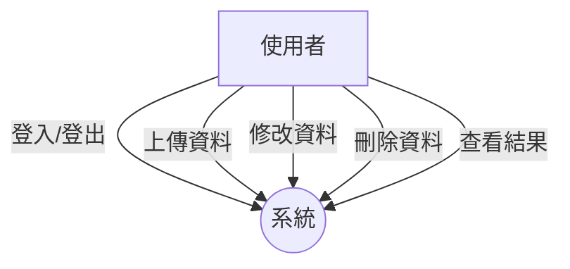

#  HW3：功能性需求與非功能性需求

## 一、功能性需求（Functional Requirements）

1. 系統能夠讓使用者登入與登出帳號。  
2. 使用者可以透過介面上傳、刪除與修改資料。  
3. 系統需即時顯示使用者操作結果（例如：成功、失敗或錯誤訊息）。

---

## 二、非功能性需求（Non-Functional Requirements）

1. 系統操作介面需於 3 秒內完成載入。  
2. 服務可用性需達 99% 以上。  
3. 系統需支援桌機與行動裝置的響應式設計。

---

## 三、功能分解圖（Functional Decomposition Diagram, FDD）

---

## 四、使用案例圖（Use Case Diagram）

---

## 五、使用案例說明（Use Case Descriptions）

