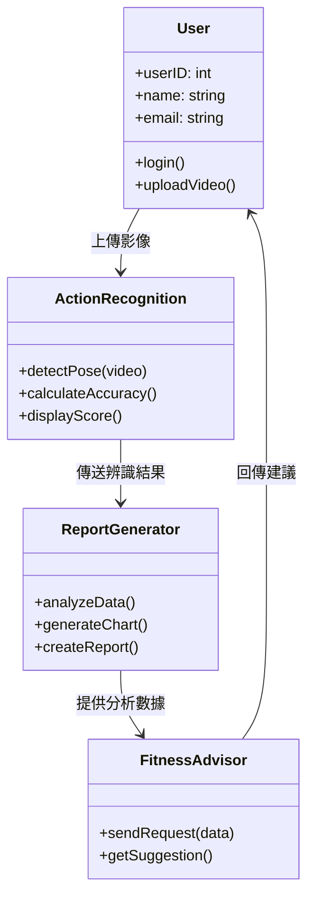
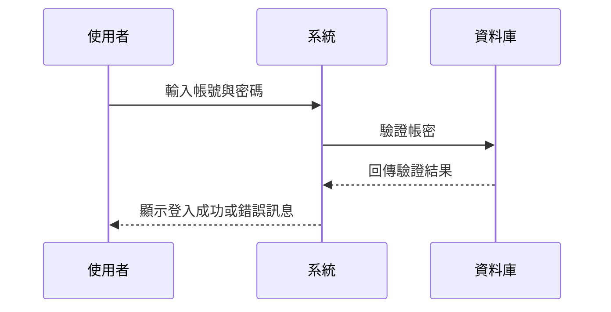
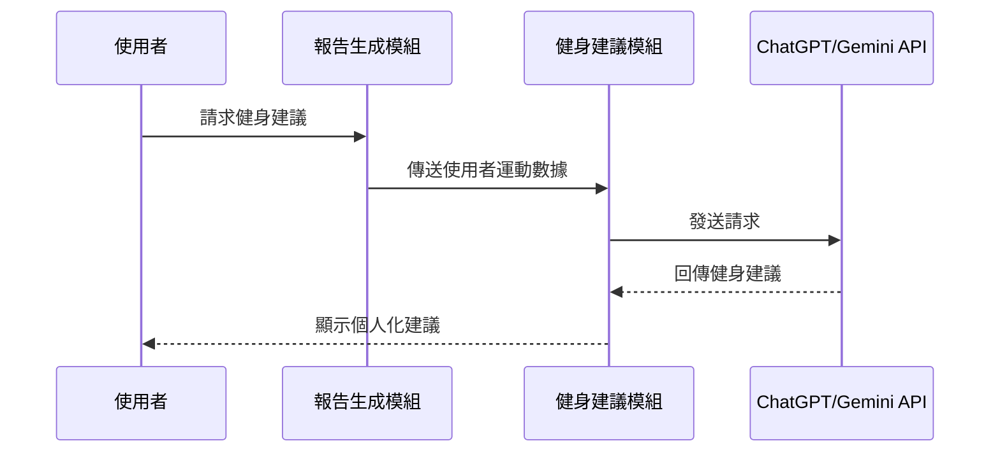
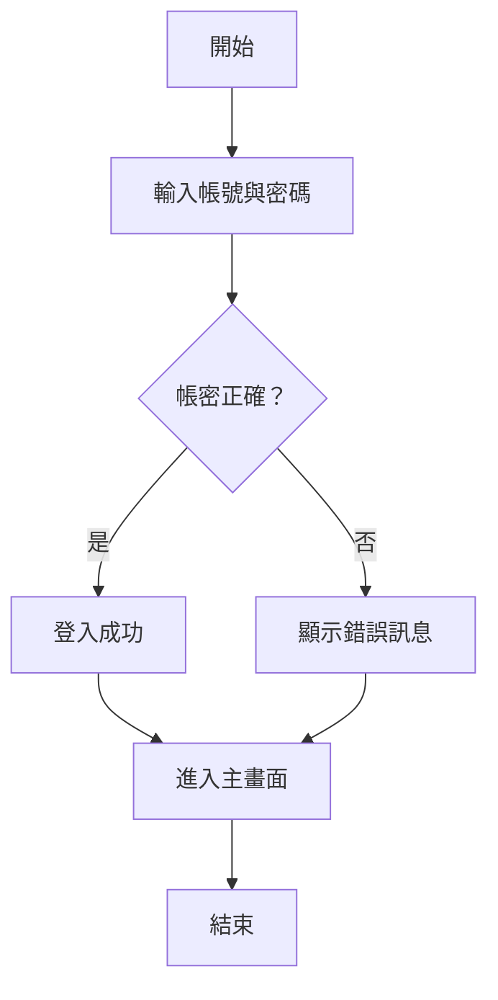
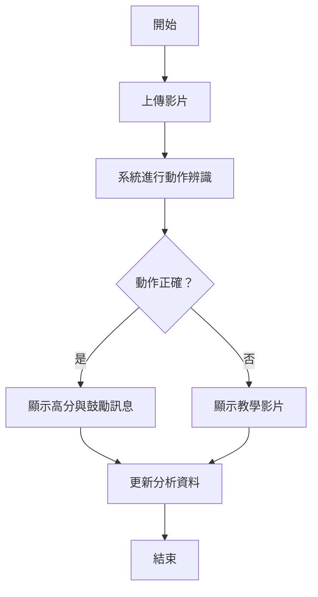
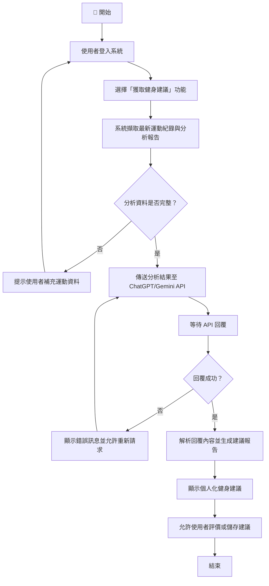

# 小組作業 5

## 一、UML 類別圖（Class Diagram）

系統主要包含四個核心類別：使用者（User）、動作辨識（ActionRecognition）、報告生成（ReportGenerator）、與健身建議（FitnessAdvisor）。

## 二、循序圖（Sequence Diagrams）

### 案例一：登入系統

### 案例二：上傳與辨識動作

### 案例三：獲取個人化健身建議

## 三、活動圖（Activity Diagrams）

### 案例一：登入系統

### 案例二：上傳與辨識動作

### 案例三：獲取個人化健身建議

