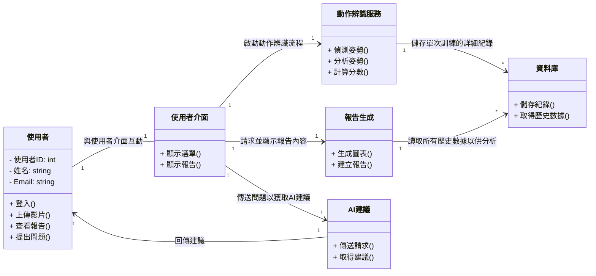
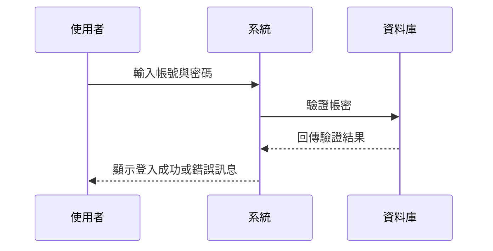
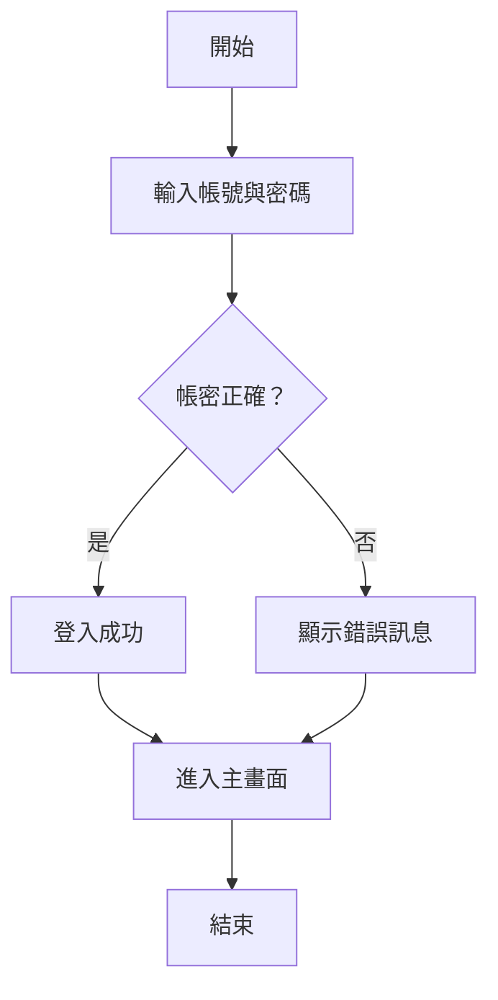
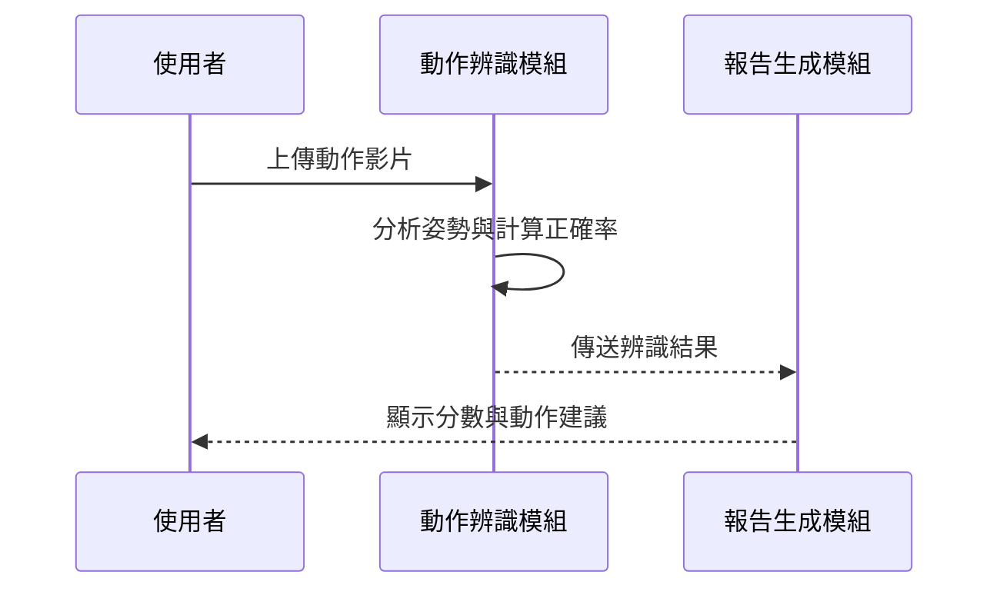
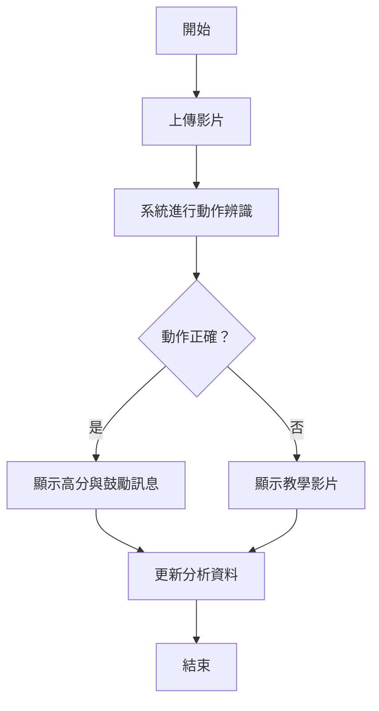
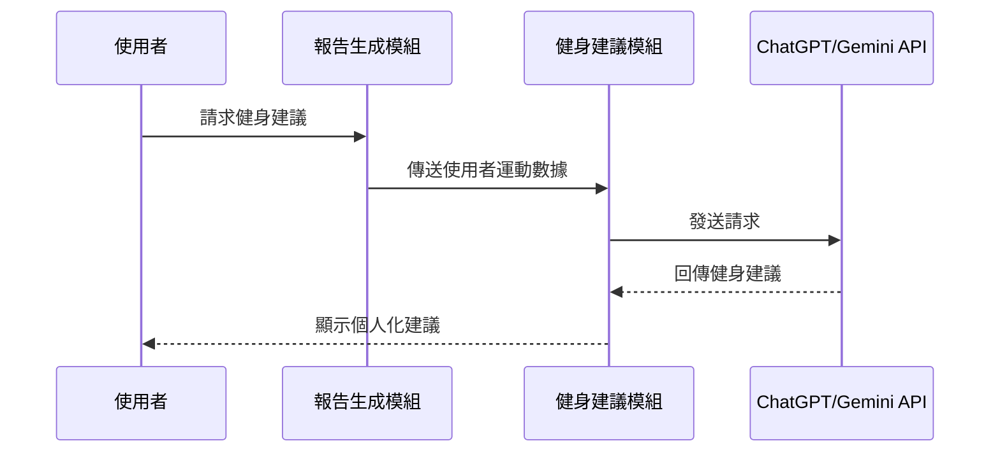

# 小組作業 5

## UML 類別圖（Class Diagram）

```mermaid
classDiagram
    direction LR

    class 使用者 {
        - 使用者ID: int
        - 姓名: string
        - Email: string
        + 登入()
        + 上傳影片()
        + 查看報告()
        + 提出問題()
    }

    class 使用者介面 {
        + 顯示選單()
        + 顯示報告()
    }

    class 動作辨識服務 {
        + 偵測姿勢()
        + 分析姿勢()
        + 計算分數()
    }

    class 資料庫 {
        + 儲存紀錄()
        + 取得歷史數據()
    }

    class 報告生成 {
        + 生成圖表()
        + 建立報告()
    }

    class AI建議 {
        + 傳送請求()
        + 取得建議()
        
    }

    使用者 "1" -- "1" 使用者介面 : 與使用者介面互動
    使用者介面 "1" --> "1" 動作辨識服務 : 啟動動作辨識流程
    使用者介面 "1" --> "1" 報告生成 : 請求並顯示報告內容
    使用者介面 "1" --> "1" AI建議 : 傳送問題以獲取AI建議
    動作辨識服務 "1" --> "*" 資料庫 : 儲存單次訓練的詳細紀錄
    報告生成 "1" --> "*" 資料庫 : 讀取所有歷史數據以供分析
    AI建議 "1" --> "1" 使用者 : 回傳建議

```

## 案例一：登入系統
### 循序圖

```mermaid
sequenceDiagram
    participant U as 使用者
    participant S as 系統
    participant DB as 資料庫

    U->>S: 輸入帳號與密碼
    S->>DB: 驗證帳密
    DB-->>S: 回傳驗證結果
    S-->>U: 顯示登入成功或錯誤訊息
```
### 活動圖

```mermaid
flowchart TD
    A[開始] --> B[輸入帳號與密碼]
    B --> C{帳密正確？}
    C -->|是| D[登入成功]
    C -->|否| E[顯示錯誤訊息]
    D --> F[進入主畫面]
    E --> F
    F --> G[結束]
```

## 案例二：上傳與辨識動作
### 循序圖

```mermaid
sequenceDiagram
    participant U as 使用者
    participant AR as 動作辨識模組
    participant RG as 報告生成模組

    U->>AR: 上傳動作影片
    AR->>AR: 分析姿勢與計算正確率
    AR-->>RG: 傳送辨識結果
    RG-->>U: 顯示分數與動作建議

```
### 活動圖

```mermaid
flowchart TD
    A[開始] --> B[上傳影片]
    B --> C[系統進行動作辨識]
    C --> D{動作正確？}
    D -->|是| E[顯示高分與鼓勵訊息]
    D -->|否| F[顯示教學影片]
    E --> G[更新分析資料]
    F --> G
    G --> H[結束]
```

## 案例三：獲取個人化健身建議
### 循序圖

```mermaid
sequenceDiagram
    participant U as 使用者
    participant RG as 報告生成模組
    participant FA as 健身建議模組
    participant API as ChatGPT/Gemini API

    U->>RG: 請求健身建議
    RG->>FA: 傳送使用者運動數據
    FA->>API: 發送請求
    API-->>FA: 回傳健身建議
    FA-->>U: 顯示個人化建議
```
### 活動圖

```mermaid
flowchart TD
    %% 範例：更詳細、更真實的活動圖
    A[開始] --> B[使用者登入系統]
    B --> C[選擇「獲取健身建議」功能]
    C --> D[系統擷取最新運動紀錄與分析報告]
    D --> E{分析資料是否完整？}
    E -->|否| F[提示使用者補充運動資料]
    F --> B
    E -->|是| G[傳送分析結果至 ChatGPT/Gemini API]
    G --> H[等待 API 回覆]
    H --> I{回覆成功？}
    I -->|否| J[顯示錯誤訊息並允許重新請求]
    J --> G
    I -->|是| K[解析回覆內容並生成建議報告]
    K --> L[顯示個人化健身建議]
    L --> M[允許使用者評價或儲存建議]
    M --> N[結束]
```
