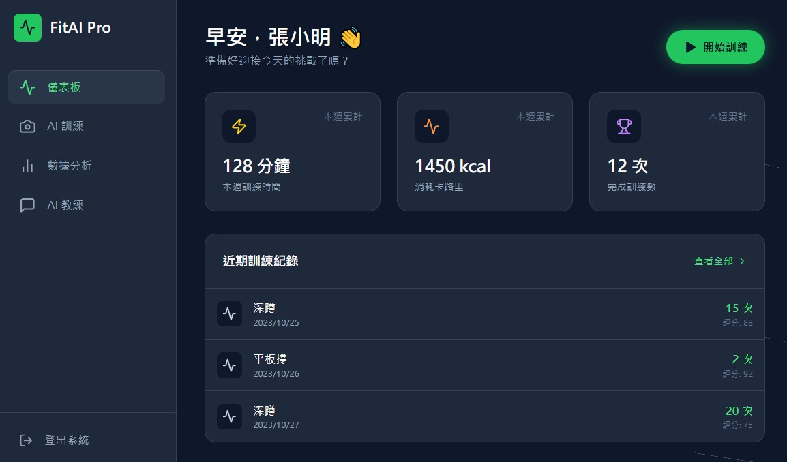
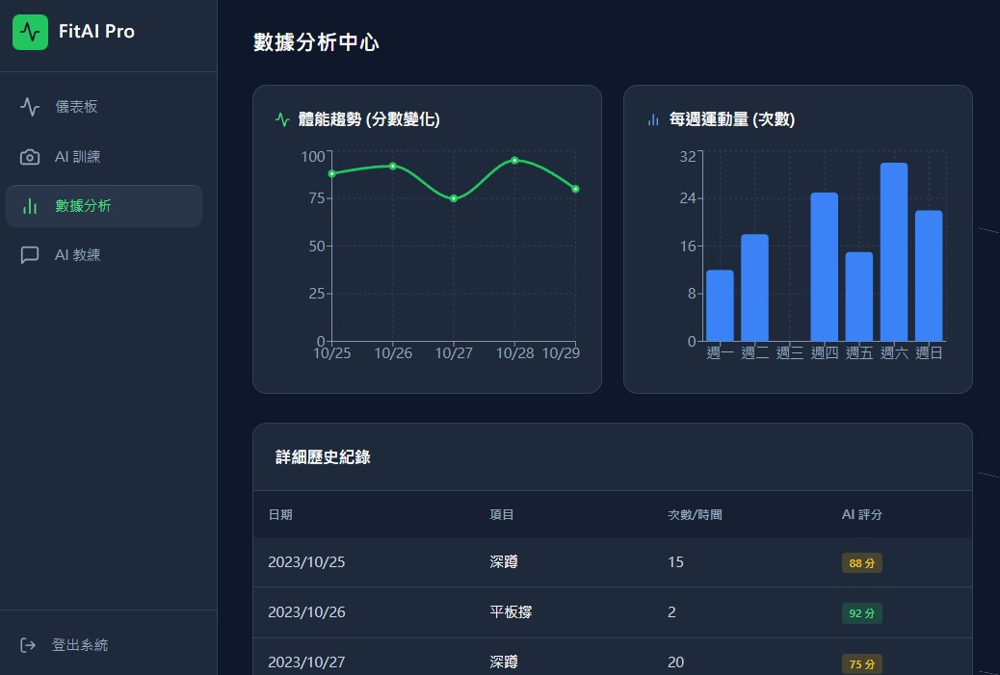

請透過分鏡板(storyboard) 的形式向使用者展示初始的螢幕設計:
可以利用手繪或軟體繪製
清楚標示所有輸入的欄位之資料型態與驗證規則
列出所有螢幕與報表列印的欄位之名稱與功能

# 分鏡板(storyboard) 

## 1.使用者登入畫面

## 2.首頁 

### 欄位名稱與功能
#### A. 本週數據彙總
| 欄位名稱 | 範例數據 | 功能說明 |
| :--- | :--- | :--- |
| **本週訓練時間** | 128 分鐘 | 顯示本週累積的總訓練時間。 |
| **消耗卡路里** | 1450 kcal | 顯示本週累積消耗的總卡路里。 |
| **完成訓練次數** | 12 次 | 顯示本週完成的總訓練次數。 |

#### B. 近期訓練紀錄 (列表)

| 欄位名稱 | 範例數據 | 功能說明 |
| :--- | :--- | :--- |
| **項目** | 深蹲、平板撐 | 顯示訓練的類型名稱。 |
| **日期** | 2023/10/25 | 顯示該筆訓練完成的日期。 |
| **次數/時間** | 15 次, 2 次, 20 次 | 顯示訓練量（次數或持續時間）。 |
| **AI 評分** | 88, 92, 75 | 顯示 AI 系統對該次訓練姿勢或表現的評分。 |

## 3. 數據分析中心

#### A. 圖表數據

| 欄位名稱 | 視覺形式 | 功能說明 |
| :--- | :--- | :--- |
| **體能趨勢 (分數變化)** | 折線圖 | 顯示使用者每日訓練評分（體能表現）的變化趨勢。 |
| **每週運動量 (天數)** | 柱狀圖 | 顯示一週內每天的運動量，通常以訓練天數或時長表示。 |

#### B. 詳細歷史紀錄 (報表/列表)

| 欄位名稱 | 範例數據 | 功能說明 |
| :--- | :--- | :--- |
| **日期** | 2023/10/25 | 訓練發生的具體日期。 |
| **項目** | 深蹲, 平板撐 | 訓練動作的名稱。 |
| **次數/時間** | 15, 2, 20 | 訓練的量化數據（次數或持續時間）。 |
| **AI 評分** | 88 分, 92 分, 75 分 | AI 系統對該次訓練姿勢或表現的評分。 |

## 4. AI 教練 

