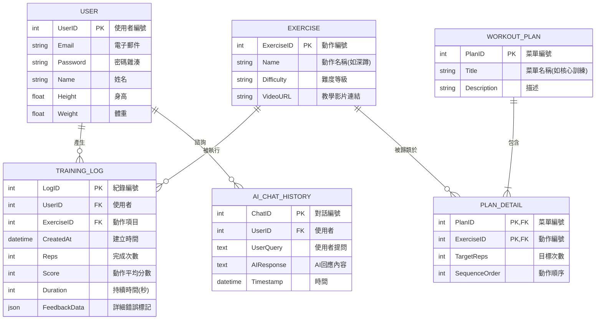

劃出實體關係圖(entity-relationship diagram, ERD)向使用者展示內部的資料庫設計:
可以利用手繪或軟體繪製
請列出兩個以上的組合實體

```mermaid
erDiagram
    %% 實體定義
    USER {
        int UserID PK "使用者編號"
        string Email "電子郵件"
        string Password "密碼雜湊"
        string Name "姓名"
        float Height "身高"
        float Weight "體重"
    }

    EXERCISE {
        int ExerciseID PK "動作編號"
        string Name "動作名稱(如深蹲)"
        string Difficulty "難度等級"
        string VideoURL "教學影片連結"
    }

    %% 組合實體 1：訓練紀錄 (解決 User 與 Exercise 的多對多關係)
    TRAINING_LOG {
        int LogID PK "紀錄編號"
        int UserID FK "使用者"
        int ExerciseID FK "動作項目"
        datetime CreatedAt "建立時間"
        int Reps "完成次數"
        int Score "動作平均分數"
        int Duration "持續時間(秒)"
        json FeedbackData "詳細錯誤標記"
    }

    WORKOUT_PLAN {
        int PlanID PK "菜單編號"
        string Title "菜單名稱(如核心訓練)"
        string Description "描述"
    }

    %% 組合實體 2：菜單內容 (解決 Plan 與 Exercise 的多對多關係)
    PLAN_DETAIL {
        int PlanID PK,FK "菜單編號"
        int ExerciseID PK,FK "動作編號"
        int TargetReps "目標次數"
        int SequenceOrder "動作順序"
    }

    AI_CHAT_HISTORY {
        int ChatID PK "對話編號"
        int UserID FK "使用者"
        text UserQuery "使用者提問"
        text AIResponse "AI回應內容"
        datetime Timestamp "時間"
    }

    %% 關係連接
    USER ||--o{ TRAINING_LOG : "產生"
    EXERCISE ||--o{ TRAINING_LOG : "被執行"
    
    WORKOUT_PLAN ||--|{ PLAN_DETAIL : "包含"
    EXERCISE ||--o{ PLAN_DETAIL : "被歸類於"

    USER ||--o{ AI_CHAT_HISTORY : "諮詢"


```
