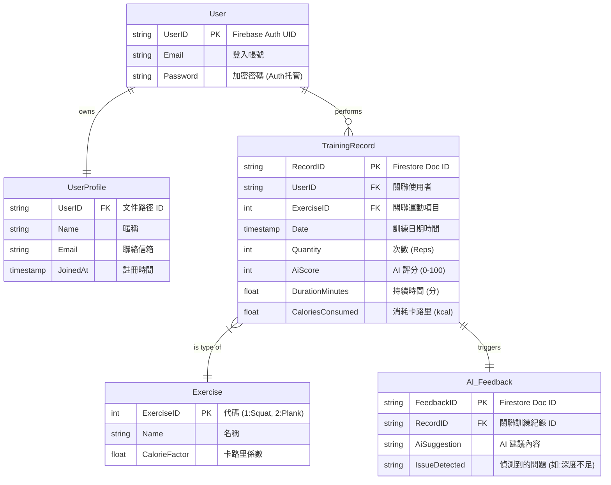

# 系統實體關係圖 (ERD)

```mermaid
erDiagram
    %% 使用者主體 (由 Firebase Auth 與 Firestore Profile 構成)
    User ||--|| UserProfile : "owns"
    User ||--o{ TrainingRecord : "performs"
    
    %% 訓練紀錄與其他實體的關係
    TrainingRecord }|--|| Exercise : "is type of"
    TrainingRecord ||--|| AI_Feedback : "triggers"

    %% 實體定義
    User {
        string UserID PK "Firebase Auth UID"
        string Email "登入帳號"
        string Password "加密密碼 (Auth托管)"
    }

    UserProfile {
        string UserID FK "文件路徑 ID"
        string Name "暱稱"
        string Email "聯絡信箱"
        timestamp JoinedAt "註冊時間"
    }

    Exercise {
        int ExerciseID PK "代碼 (1:Squat, 2:Plank)"
        string Name "名稱"
        float CalorieFactor "卡路里係數"
    }

    TrainingRecord {
        string RecordID PK "Firestore Doc ID"
        string UserID FK "關聯使用者"
        int ExerciseID FK "關聯運動項目"
        timestamp Date "訓練日期時間"
        int Quantity "次數 (Reps)"
        int AiScore "AI 評分 (0-100)"
        float DurationMinutes "持續時間 (分)"
        float CaloriesConsumed "消耗卡路里 (kcal)"
    }

    AI_Feedback {
        string FeedbackID PK "Firestore Doc ID"
        string RecordID FK "關聯訓練紀錄 ID"
        string AiSuggestion "AI 建議內容"
        string IssueDetected "偵測到的問題 (如:深度不足)"
    }
```
