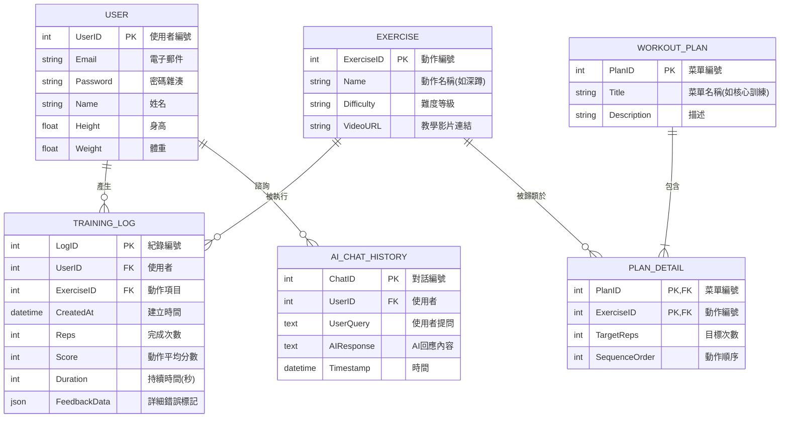

# 實體關係圖(ERD)

---

## 組合實體說明 (Composite Entities)
本系統包含兩個主要的組合實體，用於解決多對多 (Many-to-Many) 的關聯問題：

#### 1. 訓練紀錄 (TRAINING_LOG)
* **關聯實體：** 連接 `USER` (使用者) 與 `EXERCISE` (運動項目)。
* **功能描述：** 當使用者完成一次運動（例如做了一組深蹲）時，系統會建立一筆紀錄。
* **特有屬性：**
    * `Score` (分數)：由 AI 根據骨架角度計算出的準確度 (0-100)。
    * `Reps` (次數)：實際完成的動作次數。
    * `ErrorTags`：紀錄動作錯誤的細節（例如：膝蓋內夾、背部彎曲），供報表分析使用。

#### 2. 菜單內容 (PLAN_DETAIL)
* **關聯實體：** 連接 `WORKOUT_PLAN` (訓練菜單) 與 `EXERCISE` (運動項目)。
* **功能描述：** 定義一個訓練菜單中包含了哪些動作，以及該動作在該菜單中的具體要求。
* **特有屬性：**
    * `TargetReps` (目標次數)：例如「新手菜單」中的深蹲只需做 10 下，但在「高強度菜單」中需做 50 下。
    * `Sequence` (順序)：指定該動作在菜單流程中的執行順序（如：先熱身，再深蹲）。

---

## 其他實體規格 (Data Dictionary)

| 實體名稱 | 類型 | 說明 | 主要欄位 (PK/FK) |
| :--- | :--- | :--- | :--- |
| **USER** | 核心實體 | 儲存使用者的帳號與基本身體數值。 | `UserID` (PK) |
| **EXERCISE** | 核心實體 | 儲存系統支援的所有健身動作模型資訊。 | `ExerciseID` (PK) |
| **WORKOUT_PLAN** | 核心實體 | 儲存預設或自訂的訓練計畫集合。 | `PlanID` (PK) |
| **AI_CHAT_HISTORY** | 弱實體 | 儲存使用者與 AI 教練的歷史對話，用於 RAG 檢索增強生成。 | `ChatID` (PK), `UserID` (FK) |

---

