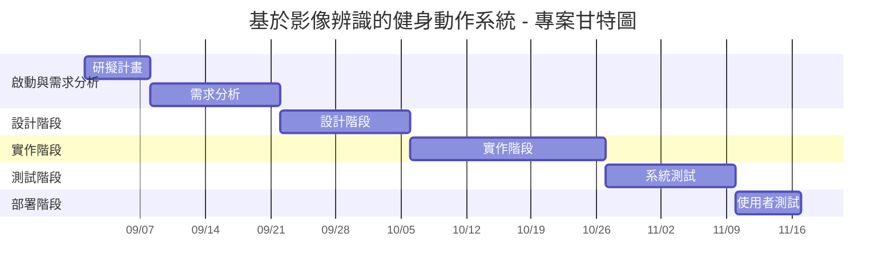

 顯示在小組的github 上，請列出專案個別組員的任務，專題甘特圖與PERT/CPM圖
 
## 1.組員任務

| 組員   | 角色 | 任務                                                                 | 預估時間 |
|--------|------|--------------------------------------------------------------------------|----------|
| 陳宥蓁 | 組長 | - 延伸 API 串接：整合 ChatGPT 或 Gemini API。 - 動作辨識模組：手機相機整合與正確率計算邏輯。 - 測試與整合全系統。 - 撰寫最終報告。 | 4-6 週   | 
| 許筑翕 | 組員 | - 動作改善追蹤功能開發（追蹤用戶動作趨勢）。 - 分析與報告功能：統計圖表生成（Matplotlib 或 Chart.js）。 - 教學影片嵌入（HTML5 播放器）。 | 3-5 週   | 
| 辜雅雯 | 組員 |  - 整體專案協調與 GitHub 管理（commit、branch、pull request）。  - 動作辨識模組：影像辨識模型訓練（OpenCV 或 MediaPipe）。 - 運動表現趨勢分析（資料儲存與視覺化）。 | 4-6 週   |

## 2.甘特圖

專案時程（2025/9/1 至 2025/11/30，約 12 週）。

## 3.PERT/CPM圖

